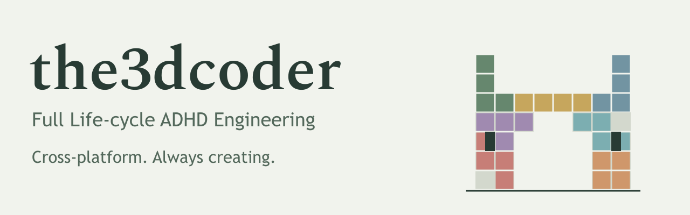
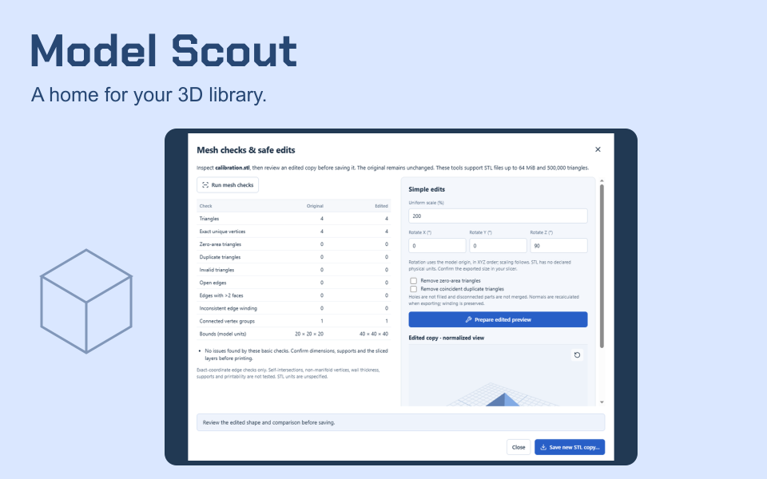
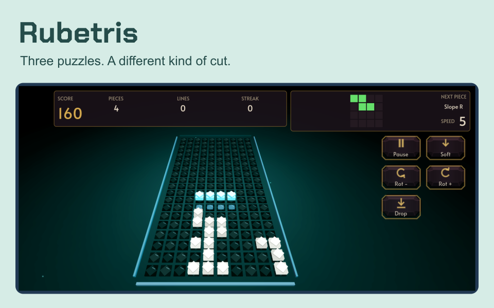
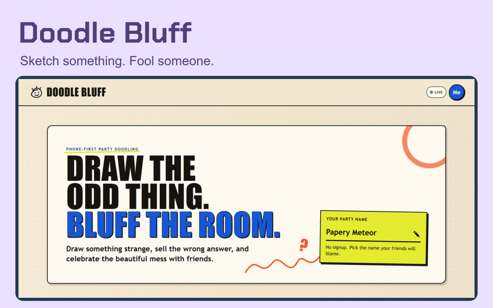
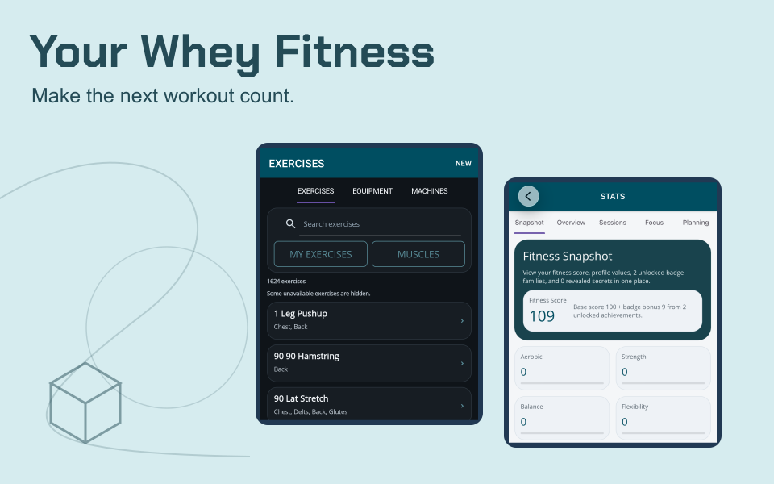
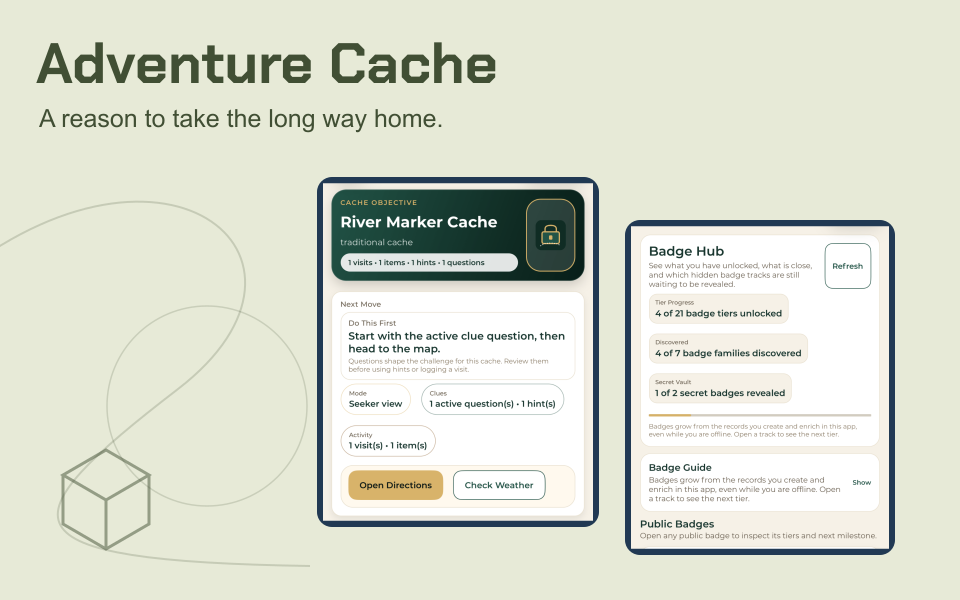
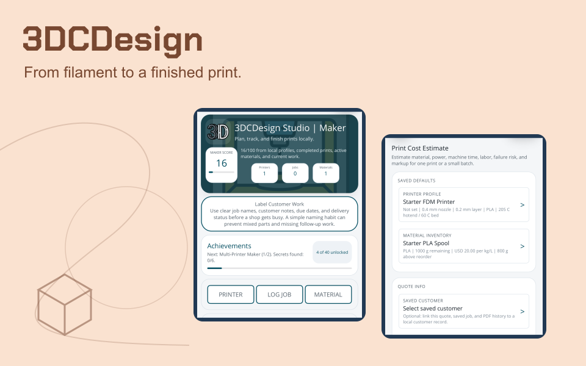

<picture>
  <source media="(max-width: 600px) and (prefers-color-scheme: dark)" srcset="./assets/studio-mobile-dark.svg">
  <source media="(max-width: 600px)" srcset="./assets/studio-mobile-light.svg">
  <source media="(prefers-color-scheme: dark)" srcset="./assets/studio-dark.svg">
  
</picture>

# Earl Hayes

**Senior Software Engineer at WorkWave. Founder of Big Bwain LLC.**

My beautiful wife, daughter, and my family are the reason behind my endless drive (with a bit of ADHD). Taking care of them is what drives me to keep learning, building, and delivering.

I build across mobile, web, desktop, cloud, and hardware. My career spans from technical support, QA/Automation, into software engineering, architecture, and mentoring. I honestly just like creating and occasionally dive into additive engineering, CAD, and designing models to solve everyday problems.

I use my ADHD to my advantage to the point that my side projects have side projects.

- [**earlhayes.com**](https://earlhayes.com)
- [**the3dcoder.com**](https://the3dcoder.com) 
- [**bigbwain.com**](https://bigbwain.com) 

## Engineering the whole lifecycle

| Part of the work | What I take on |
| :-- | :-- |
| **Understand & design** | Real user needs, architecture, data models, and practical tradeoffs. |
| **Build & connect** | Cross-platform clients, APIs, offline data, cloud services, and hardware integrations. |
| **Test & deliver** | QA, automation, accessibility, deployments, and app-store releases. |
| **Support & improve** | Troubleshooting, maintenance, iteration, and helping other engineers grow. |

[Mobile architecture & offline data](https://earlhayes.com/work/your-whey-fitness-platform) · [Linux driver & hardware integration](https://earlhayes.com/work/linux-keydial-workflow) · [Career background](https://earlhayes.com/about)

## A few things I've been building

Real products, useful tools, and games with a little personality. These are selected projects across my recent work; their links show current availability.

  
  

- [**Model Scout**](https://github.com/the3dcoder/ModelScout): A local Windows workbench for 3D models, previews, duplicate review, safe transfers, and print-cost estimates. [Explore the source](https://github.com/the3dcoder/ModelScout).
- [**Rubetris**](https://rubetris.com): Debrix, Rosette, and Erikade. Three gem-cutting puzzles with distinct rules, seeded runs, and replayable challenges. [Play in the browser](https://play.rubetris.com).

  
  

- [**Doodle Bluff**](https://doodlebluff.com): A drawing-and-bluffing party game. Sketch something strange, invent a convincing answer, and discover who fooled whom. Free beta.
- [**Your Whey Fitness**](https://yourwheyfitness.com): Workout planning, session logging, history, and progress, with a wider platform for personal fitness and trainer or gym workflows.

  
  

- [**Adventure Cache**](https://adventurecacheapp.com): Create outdoor adventures, hide caches, follow clues, log finds, and earn badges. Mobile engineering that gets people away from their desks.
- [**3DCDesign**](https://the3dcoder.com/work/3dcdesign): Local print-shop tools for printers, materials, jobs, estimates, and reports, built around the practical work of making physical things.

## More from the workshop

- [**Cache Creature**](https://www.cachecreature.com): Collectible cards inspired by moments, signals, prompts, and scans.
- [**Cache Pal**](https://cachepal.com): Hatch, raise, battle, and breed living pixel creatures in an offline-capable browser game.
- [**City Jumper**](https://cityjumper.io): A rooftop platformer. Chase the sunset, find your rhythm, and climb the leaderboard.
- [**Wordsracer**](https://wordsracer.com): Race through Word Arena or explore a letter tray in Word Garden.
- [**Keydial Commander**](https://github.com/the3dcoder/KeydialCommander): A Linux driver and visual macro-pad editor for the Huion K20, with profiles, shortcuts, and a local API. MIT source.
- **Cacheboard**: A local workbench for planning and coordinating AI-assisted development. Private project in development; included in the [AI project catalog](https://the3dcoder.com/?topic=ai).

Also on my workbench: **Pocket Words**, a quiet offline Android word game with large controls, accessible clues, and no accounts or ads. Currently a development build.

Away from app screens, I design [functional CAD and 3D prints](https://the3dcoder.com/designs), experiment with [MAUI 3D painting](https://github.com/the3dcoder/MAUI3DColorMixing), and work on [rubybiscuits e-paper firmware](https://github.com/the3dcoder/rubybiscuits).

## Tools I reach for

| Where | Tools |
| :-- | :-- |
| **Mobile & desktop** | C#, .NET, MAUI, WPF, Swift, Kotlin, Java, Electron |
| **Web & games** | TypeScript, React, Astro, Phaser, Godot |
| **Services & data** | ASP.NET Core, Node.js, SQL, SQLite, Azure |
| **Hardware & making** | Python, Linux, CAD, additive manufacturing |

The stack follows the problem. The goal is a product people can use, trust, and keep using.

## Let's build something useful

For engineering experience and case studies, visit [earlhayes.com](https://earlhayes.com). For project work across the full lifecycle, visit [Big Bwain LLC](https://bigbwain.com).

[Email me](mailto:earl@bigbwain.com) · [LinkedIn](https://www.linkedin.com/in/earl-hayes-27467844) · [Full project catalog](https://the3dcoder.com)
